# Industry-Based News Evaluation Refactoring

## Context: How the Current Process Works (Before This Plan)

This section documents the existing evaluation process so that future changes can be compared against it.

### Current data model

- **SmartPortfolio** ([src/lib/models/portfolio.ts](src/lib/models/portfolio.ts)): holds `id`, `username`, `displayName`, `userId`, `holdings[]`, `totalPositions`, `lastUpdated`.
- **PortfolioHolding**: holds `instrumentId`, `instrumentName`, `symbol`, `assetType`, `allocation` (%), `positionType` (Long/Short), `leverage`, optional `sector` (from eToro, 9 categories), optional `positionId`.
- No `industry` field on holdings. No `industryWeights` on portfolios.

### Current sync process

[portfolio-service.ts](src/lib/services/portfolio-service.ts) — `syncPortfolioData()`:

1. Fetches positions for each of the 15 Alpha portfolios from eToro API.
2. Resolves instrument names via `getInstrumentsByIds()` (eToro instruments API).
3. Resolves sector names via `getIndustryNames()` (eToro stocks-industries API) — **only 9 categories**: Basic Materials, Conglomerates, Consumer Goods, Financial, Healthcare, Industrial Goods, Services, Technology, Utilities.
4. Merges positions by (instrumentId, positionType), sets `sector` on each holding.
5. Writes `data/portfolios.json`.

### Current news evaluation

[ai-service.ts](src/lib/services/ai-service.ts) — `analyzeNewsImpact()`:

1. For each portfolio, sends Claude the **full top-10 holdings + sector breakdown** (via `holdingsCompactSummary()`).
2. Claude returns `affectedAssets[]` with per-asset `impactLevel` (low/medium/high), `direction`, `reasoning`.
3. `relevancePercent` is computed as `sum of (allocation * impactLevelWeight)` for affected assets.
4. Weights: low=0.3, medium=0.65, high=1.0.

[route.ts](src/app/api/news/evaluate/route.ts) — `POST /api/news/evaluate`:

1. Runs `analyzeNewsImpact()` for all 15 portfolios in parallel (batches of 5).
2. Filters out portfolios with relevance < 5%.
3. Returns results sorted by relevance.

### Current limitations

- **Token-heavy**: sends ~300-500 input tokens per portfolio x 15 = ~4,500-7,500 total.
- **Coarse industry data**: eToro only provides 9 categories. Apple is "Consumer Goods", Google is "Services", ETFs are all "Financial".
- **No pre-computed industry weights**: sector breakdown is computed inside `holdingsCompactSummary()` on every call, not stored.
- **Non-stock assets** (crypto, ETFs, indices, commodities) often have no `sector` at all — 86 out of 1,152 unique instruments.

### Portfolio scale

- 15 portfolios, 2,058 total holdings, 1,152 unique instruments.
- Largest portfolio: BalancedPicks (649 holdings).
- Non-stock assets can have significant weight (e.g. BTC = 14.9% in Short-Tech, crypto+ETFs = 40% in MarketPicks).

### Key files

| File | Role |
|------|------|
| [src/lib/models/portfolio.ts](src/lib/models/portfolio.ts) | Data model for portfolios and holdings |
| [src/lib/services/portfolio-service.ts](src/lib/services/portfolio-service.ts) | Sync + cache read/write for portfolios |
| [src/lib/services/ai-service.ts](src/lib/services/ai-service.ts) | Claude AI: `analyzeNewsImpact()`, `generatePostContent()`, `generateEducationalContent()` |
| [src/lib/utils/instrument-helper.ts](src/lib/utils/instrument-helper.ts) | Fetch instrument metadata + industry names from eToro |
| [src/app/api/news/evaluate/route.ts](src/app/api/news/evaluate/route.ts) | API: orchestrates evaluation |
| [src/app/e-poster/evaluate/page.tsx](src/app/e-poster/evaluate/page.tsx) | UI: displays evaluation results, user selects portfolios |
| [src/app/e-poster/review/page.tsx](src/app/e-poster/review/page.tsx) | UI: review and post generated content |
| [src/lib/config/portfolios.ts](src/lib/config/portfolios.ts) | Master list of 15 portfolio usernames |
| [data/portfolios.json](data/portfolios.json) | Cached portfolio holdings |
| [data/bios.json](data/bios.json) | Cached portfolio bios |

---

## Strategy

Replace the single-pass per-portfolio Claude call with a two-phase industry-first approach:

1. **Enrich portfolio data** — Use a user-supplied taxonomy file (keyed by symbol) to classify stock holdings into specific industries. Each stock can map to multiple industries based on revenue streams (e.g. Apple = 52% Consumer Electronics, 28% Software & Services, etc.). For non-stock assets (crypto, ETFs, indices, commodities) not in the taxonomy, maintain an auto-generated `unmapped-industries.json` that accumulates LLM-classified industries incrementally across syncs.

2. **Pre-compute industry weights** — During sync, compute each portfolio's industry concentration breakdown using the weighted composition (holding allocation x revenue-based industry weights) and store it as `industryWeights` on the portfolio.

3. **Two-phase evaluation** — Phase 1 sends only industry weights to Claude (cheap). Phase 2 picks ~10 holdings from the most affected industries for individual evaluation and tagging.

## Architecture

```mermaid
flowchart TD
    subgraph sync [Sync Phase]
        SyncPortfolios["Sync holdings from eToro"]
        TaxonomyLookup["Resolve industry per holding from taxonomy file"]
        UnmappedCheck["Check unmapped-industries.json for remaining"]
        LLMClassify["Send new unmapped assets to Claude for classification"]
        SaveUnmapped["Save new classifications to unmapped-industries.json"]
        ComputeWeights["Compute industryWeights per portfolio"]
        Cache["Save to portfolios.json"]
        SyncPortfolios --> TaxonomyLookup --> UnmappedCheck
        UnmappedCheck -->|"found in cache"| ComputeWeights
        UnmappedCheck -->|"not found"| LLMClassify --> SaveUnmapped --> ComputeWeights
        ComputeWeights --> Cache
    end

    subgraph evaluate [Evaluation Phase]
        NewsInput["News Input"]
        Phase1["Phase 1: Send industry weights to Claude"]
        CalcRelevance["relevance = sum of industryWeight x impactScore"]
        Filter["Filter portfolios above threshold"]
        Phase2["Phase 2: Pick ~10 holdings from top affected industries"]
        TagHoldings["Claude evaluates holdings for tagging"]
        NewsInput --> Phase1 --> CalcRelevance --> Filter --> Phase2 --> TagHoldings
    end
```



## Data directory after changes

```
data/
├── portfolios.json            ← synced from eToro, now includes industryWeights + industries per holding
├── bios.json                  ← synced from eToro (unchanged)
├── taxonomy.<ext>             ← USER-SUPPLIED, maps stock symbols to revenue-based industry breakdowns
└── unmapped-industries.json   ← AUTO-GENERATED, LLM-classified non-stock/unmapped assets
```

---

## Step-by-Step Changes

### Step 1. Update the data model

**File:** [src/lib/models/portfolio.ts](src/lib/models/portfolio.ts)

Each holding now has **multiple industries** based on the company's revenue streams. Add `IndustryBreakdown` for per-holding data, `IndustryWeight` for portfolio-level aggregation, and `industryWeights` on `SmartPortfolio`:

```typescript
export interface IndustryBreakdown {
  industry: string;     // e.g. "Consumer Electronics", "Cloud Computing"
  weight: number;       // percentage of this company's revenue from this industry (0-100)
}

export interface PortfolioHolding {
  // ... existing fields ...
  sector?: string;                   // broad — from eToro (kept for reference)
  industries?: IndustryBreakdown[];  // revenue-based breakdown from taxonomy (NEW)
}

export interface IndustryWeight {
  industry: string;     // specific industry name
  weight: number;       // percentage of portfolio allocation (0-100)
}

export interface SmartPortfolio {
  // ... existing fields ...
  industryWeights: IndustryWeight[];   // NEW — pre-computed during sync
}
```

**Example:** Apple (AAPL) at 10% portfolio allocation with taxonomy breakdown:

```json
{
  "symbol": "AAPL",
  "allocation": 10.0,
  "industries": [
    { "industry": "Consumer Electronics", "weight": 52 },
    { "industry": "Software & Services", "weight": 28 },
    { "industry": "Financial Services", "weight": 10 },
    { "industry": "Advertising", "weight": 10 }
  ]
}
```

AAPL's contribution to portfolio industry weights:
- Consumer Electronics: 10% x 52% = 5.2%
- Software & Services: 10% x 28% = 2.8%
- Financial Services: 10% x 10% = 1.0%
- Advertising: 10% x 10% = 1.0%

### Step 2. Create taxonomy helper with unmapped assets support

**New file:** `src/lib/utils/taxonomy-helper.ts`

This module handles the full industry resolution chain:

**A. Taxonomy file loader** — Reads the user-supplied taxonomy file from `data/taxonomy.<ext>` (format TBD — CSV, JSON, or Excel). Each stock can map to multiple industries with revenue-based weights. Returns a `Map<symbol, IndustryBreakdown[]>`.

**B. Unmapped industries cache** — Reads/writes `data/unmapped-industries.json`. For unmapped assets (crypto, ETFs, commodities, etc.), stores a single-industry classification: `{ "BTC": [{ "industry": "Cryptocurrency", "weight": 100 }], ... }`. Simple assets typically have one industry at 100%.

**C. LLM classification for new unmapped assets** — Collects symbols not found in either the taxonomy or the unmapped cache. Sends them to Claude in a single batch to classify by industry (may return multiple industries per asset if appropriate, e.g. an ETF tracking multiple sectors). Saves results back to `unmapped-industries.json`.

**D. Main lookup function** — `resolveIndustries(symbol)` checks in order:

1. Taxonomy file (by symbol) -> found? return `IndustryBreakdown[]`.
2. `unmapped-industries.json` (by symbol) -> found? return `IndustryBreakdown[]`.
3. Not found -> return `undefined` (will be sent to LLM in batch).

**E. Batch resolve function** — `resolveAllIndustries(holdings[])`:

1. Resolve each symbol through the lookup chain.
2. Collect all unresolved symbols (with their instrument names for LLM context).
3. If any unresolved: send batch to Claude for classification.
4. Save new classifications to `unmapped-industries.json`.
5. Return complete `Map<symbol, IndustryBreakdown[]>`.

After a few syncs, `unmapped-industries.json` will cover all non-taxonomy assets and no LLM calls will be needed.

```typescript
export function loadTaxonomy(): Map<string, IndustryBreakdown[]>
export function loadUnmappedIndustries(): Map<string, IndustryBreakdown[]>
export function saveUnmappedIndustries(map: Map<string, IndustryBreakdown[]>): void
export function resolveIndustries(symbol: string): IndustryBreakdown[] | undefined
export async function resolveAllIndustries(
  holdings: Array<{ symbol: string; name: string }>
): Promise<Map<string, IndustryBreakdown[]>>
export async function classifyUnmappedAssets(
  assets: Array<{ symbol: string; name: string }>
): Promise<Map<string, IndustryBreakdown[]>>
```

### Step 3. Update sync to resolve industries and compute weights

**File:** [src/lib/services/portfolio-service.ts](src/lib/services/portfolio-service.ts)

Changes to `syncPortfolioData()` after building holdings (around line ~177):

1. Collect all unique symbols (with instrument names) across all portfolios.
2. Call `resolveAllIndustries(holdings)` — handles taxonomy lookup, unmapped cache, and LLM classification for new assets.
3. For each holding, set `industries` from the resolved map.
4. Compute `industryWeights` per portfolio using the weighted composition:

```typescript
function computeIndustryWeights(holdings: PortfolioHolding[]): IndustryWeight[] {
  const map = new Map<string, number>();
  for (const h of holdings) {
    if (h.industries && h.industries.length > 0) {
      for (const ib of h.industries) {
        const contribution = (h.allocation * ib.weight) / 100;
        map.set(ib.industry, (map.get(ib.industry) || 0) + contribution);
      }
    } else {
      map.set('Other', (map.get('Other') || 0) + h.allocation);
    }
  }
  return [...map.entries()]
    .map(([industry, weight]) => ({ industry, weight: Math.round(weight * 100) / 100 }))
    .sort((a, b) => b.weight - a.weight);
}
```

5. Set `industryWeights: computeIndustryWeights(holdings)` on each `SmartPortfolio` before writing to `data/portfolios.json`.

**Important:** Once a holding's `industries` field is set during sync and written to `portfolios.json`, it is a persistent attribute of that holding. The evaluation phase reads `industries` and `industryWeights` directly from the cached portfolio data — no taxonomy lookup or LLM call happens during evaluation. The taxonomy and unmapped-industries files are only consulted during sync.

### Step 4. Phase 1 — Industry-level impact analysis

**File:** [src/lib/services/ai-service.ts](src/lib/services/ai-service.ts)

New function: `analyzeNewsIndustryImpact()`

- **Input:** news (headline, body, url) + portfolio's `industryWeights[]` + optional bio.
- **Industry filtering:** Only send industries with weight >= 2% of the portfolio. All smaller industries are aggregated into "Other". This keeps prompts focused and avoids noise from negligible positions.
- **Industry cap:** Maximum 20 industries per Claude call. If a portfolio has more than 20 industries above 2% (unlikely), batch them.
- **What goes to Claude** (very compact):

```
PORTFOLIO: Short-Tech
Industry weights:
- Semiconductors: 25.3%
- Cloud Computing: 18.7%
- Consumer Electronics: 15.2%
- Cryptocurrency: 14.9%
- Fintech: 12.1%
- Other: 13.8%
```

- **Claude's task:** For each industry, estimate impact (0-100) and direction.
- **Relevance calculation (done in code, not by Claude):**

```
relevancePercent = sum of (industryWeight * impactScore / 100)
```

Note: "Other" bucket still participates in the relevance calculation. If Claude gives "Other" an impact of 0, those small industries contribute nothing — which is the expected behavior.

- **Output types:**

```typescript
export interface IndustryImpact {
  industry: string;
  impactScore: number;       // 0-100
  direction: 'positive' | 'negative' | 'neutral';
  reasoning: string;
}

export interface Phase1Result {
  portfolioUsername: string;
  relevancePercent: number;
  affectedIndustries: IndustryImpact[];
  reasoning: string;
}
```

### Step 5. Phase 2 — Holding-level analysis for tagging

**File:** [src/lib/services/ai-service.ts](src/lib/services/ai-service.ts)

New function: `analyzeHoldingImpact()`

**Holding selection logic** (runs in code before calling Claude):

1. From Phase 1 results, take industries with impactScore above a threshold.
2. Ensure at least 2 industries are represented.
3. From those industries, find holdings that have exposure to them. A holding qualifies if any of its `industries[]` entries match an affected industry.
4. Rank holdings by their contribution to affected industries (allocation x industry weight for matched industries), pick the top ones.
5. Cap at ~10 holdings total.

- **Input to Claude:** news + the ~10 selected holdings (symbol, name, their industry breakdown, allocation).
- **Claude returns:** Per-holding impact level (high/medium/low), direction, reasoning.
- **Output types:**

```typescript
export interface HoldingImpact {
  symbol: string;
  instrumentName: string;
  industry: string;
  impactLevel: 'low' | 'medium' | 'high';
  direction: 'positive' | 'negative' | 'neutral';
  reasoning: string;
  allocation: number;
}

export interface Phase2Result {
  portfolioUsername: string;
  affectedHoldings: HoldingImpact[];
}
```

### Step 6. Update the API route

**File:** [src/app/api/news/evaluate/route.ts](src/app/api/news/evaluate/route.ts)

Replace current single-pass logic with:

1. **Phase 1** — Run `analyzeNewsIndustryImpact()` for all 15 portfolios in parallel (batches of 5). Very cheap in tokens.
2. **Filter** — Keep portfolios with `relevancePercent >= 5%`.
3. **Phase 2** — For each passing portfolio, run `analyzeHoldingImpact()` with ~10 holdings from the top affected industries.
4. **Return** combined results:

```typescript
interface EvaluationResult {
  portfolioUsername: string;
  relevancePercent: number;
  affectedIndustries: IndustryImpact[];
  affectedHoldings: HoldingImpact[];
  reasoning: string;
}
```

### Step 7. Update the Evaluate page UI

**File:** [src/app/e-poster/evaluate/page.tsx](src/app/e-poster/evaluate/page.tsx)

- Update interfaces to match new response shape (`affectedIndustries` + `affectedHoldings`).
- Show affected **industries** with their portfolio weight and impact score.
- Show affected **holdings** (from Phase 2) with impact level/direction tags — these can be stocks, crypto, ETFs, or any asset type.
- Replace all `affectedAssets` references.

### Step 8. Update post generation and review page

**Files:**

- [src/lib/services/ai-service.ts](src/lib/services/ai-service.ts) — `generatePostContent()`: use `affectedHoldings` for `$TICKER` tagging. Holdings can be any asset type (stocks, crypto, etc.).
- [src/app/e-poster/review/page.tsx](src/app/e-poster/review/page.tsx) — update type references from `affectedAssets` to `affectedHoldings`.

### Step 9. Cleanup

- Remove old `analyzeNewsImpact()`, `holdingsCompactSummary()`, and related types (`AssetImpact`, old `NewsImpactResult`, `IMPACT_LEVEL_WEIGHTS`).
- Update [CONTEXT_SUMMARY.md](CONTEXT_SUMMARY.md) and [PROJECT_OVERVIEW.md](PROJECT_OVERVIEW.md) to document the new two-phase approach.

---

## Token Cost Comparison (estimated)

- **Current:** ~300-500 input tokens per portfolio x 15 = ~4,500-7,500 total
- **Phase 1 (new):** ~50-100 tokens per portfolio x 15 = ~750-1,500 total
- **Phase 2 (new):** ~200-300 tokens per portfolio x ~3-5 relevant portfolios = ~600-1,500
- **New total:** ~1,350-3,000 input tokens (roughly 50-60% savings)

## Prerequisites Before Execution

1. **Taxonomy file** — User must supply the file mapping symbols to specific industries (multi-industry per symbol based on revenue streams) and place it in `data/`. Format will be adapted once provided.
2. **ANTHROPIC_API_KEY** — Already configured (used for Claude calls during unmapped asset classification and evaluation).

## Step 0: Taxonomy File Validation (run once when file is received)

Before implementing any code changes, validate the taxonomy file against our portfolio data:

1. Load the taxonomy file and parse all symbol-to-industry mappings.
2. Load `data/portfolios.json` and collect all 1,152 unique symbols across all 15 portfolios.
3. Cross-reference and report:
   - **Mapped**: how many symbols are found in the taxonomy (and which industries are represented).
   - **Unmapped**: list of symbols NOT in the taxonomy, with their instrument name and max allocation across portfolios.
4. Check whether the taxonomy already covers non-stock assets (crypto like BTC/ETH/SOL, commodities like GOLD/OIL, ETFs like SOXL/UPRO, indices like SPX500/GER40). If it does, those won't need LLM classification.
5. Based on the unmapped count, decide whether LLM classification is even needed or if a small manual addition to the taxonomy covers the gaps.

This validation determines how much of the unmapped-industries.json / LLM classification machinery is actually required.
